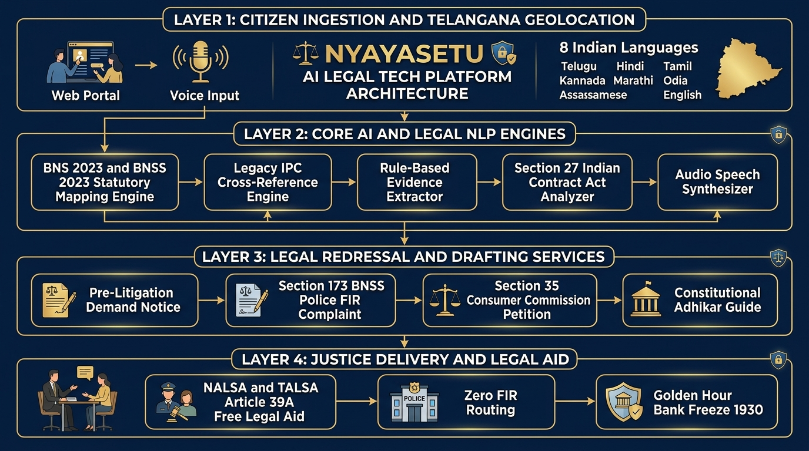

# ⚖️ NyayaSetu AI (న్యాయసేతు AI)
### AI-Powered Legal Tech & Citizen Justice Bridge for Indian Citizens
**Bharatiya Nyaya Sanhita 2023 (BNS) | BNSS 2023 | 8 Indian Languages | Dedicated Port 8003 | Zero External Cloud Dependencies**

---

## 🌟 Overview
**NyayaSetu AI** is a comprehensive, offline-first citizen justice platform built to democratize legal aid across India. It breaks the barrier of complex legalese and high pre-litigation costs by automatically translating plain-language citizen grievances into statutory provisions under the new **Bharatiya Nyaya Sanhita (BNS 2023)**, drafting court-ready legal notices and police complaints, analyzing contracts for illegal non-competes, and providing constitutional safeguards in 8 regional languages.



---

## 🏛️ Key Features

### 1. ⚖️ Legal Grievance Triage & BNS/IPC Cross-Referencing
- Analyzes plain-language input across Cybercrime, Rental Disputes, Salary Thefts, and Consumer Frauds.
- Correlates sections under **BNS 2023**, legacy **IPC 1860**, **IT Act 2000**, and the **Consumer Protection Act 2019**.
- Highlights Golden Hour recovery windows for cyber fraud (Helpline **1930**).
- Provides actionable 3-step roadmaps and court evidentiary checklists.

### 2. 📝 1-Click Court-Ready Document Drafter
- **Pre-Litigation Legal Demand Notice:** Complete with 15-day rectification window and 18% annual interest demand, formatted for Registered Post with Acknowledgement Due (RPAD).
- **Police Complaint / FIR Application:** Drafted under **Section 173 of Bharatiya Nagarik Suraksha Sanhita (BNSS 2023)**.
- **Consumer Forum Petition:** Formatted under **Section 35 of the Consumer Protection Act 2019**.
- Built-in print stylesheets for clean A4 printing or PDF export.

### 3. 🔍 Contract & Tenancy Agreement Simplifier
- Identifies illegal post-employment non-compete clauses (**Section 27, Indian Contract Act**).
- Flags arbitrary security deposit forfeiture clauses and unilateral termination clauses.
- Computes a mathematical **Contract Fairness Score (0–100)**.

### 4. 🛡️ Citizen Rights & Arrest Safeguards (Adhikar Guide)
- Digitizes landmark protections: Section 47 BNSS (Right to grounds of arrest), Section 53 BNSS (Mandatory medical exam), Article 22(2) (Production within 24 hours), and Section 43(5) BNSS (Prohibition on arresting women after sunset).
- Free Legal Aid directory under **Article 39A** (NALSA Helpline: **15100**).

### 5. 🗣️ Multilingual Localization & Spoken Legal Voice
- Full UI and statutory guidance in **8 Indian Languages**: Telugu (`te`), Hindi (`hi`), English (`en`), Tamil (`ta`), Marathi (`mr`), Kannada (`kn`), Odia (`or`), Assamese (`as`).
- Automatic Telangana centroid distance detection (Centroid: 17.3850° N, 78.4867° E) with instant state selector.
- Native audio speech advice playback with zero-network acoustic chime fallback.

---

## 🚀 Quick Start Guide

### Prerequisites
- Python 3.10 or higher
- Modern web browser (Chrome, Edge, Firefox)

### 1-Click Startup
```bash
cd nyayasetu-ai
python run.py
```

Open your browser at: **[http://127.0.0.1:8003](http://127.0.0.1:8003)**

---

## 📡 REST API Reference

| Endpoint | Method | Description |
|---|---|---|
| `/` | `GET` | Serves judicial web application portal |
| `/api/health` | `GET` | Health diagnostics and statutory census |
| `/api/legal/triage` | `POST` | Maps citizen grievance to BNS/IPC sections |
| `/api/legal/draft-notice` | `POST` | Generates Pre-Litigation Legal Demand Notice |
| `/api/legal/draft-fir` | `POST` | Generates Police Complaint under Sec 173 BNSS |
| `/api/legal/simplify-contract` | `POST` | Flags void clauses & computes Fairness Score |
| `/api/legal/safeguards` | `GET` | Returns constitutional rights directory |
| `/api/legal/voice` | `POST` | Synthesizes spoken audio advice in native languages |

---

## 📁 Ecosystem Port Mapping

| Port | Platform | Domain | Status |
|---|---|---|---|
| **8000** | **AgroPulse AI** | Smart Agriculture & Crop Disease AI | Complete |
| **8001** | **NetraShiksha AI** | Assistive AI Education for Visually Impaired | Complete |
| **8002** | **SurakshaVision AI** | Women's Safety & Edge Threat Intelligence | Complete |
| **8003** | **NyayaSetu AI** | Citizen Justice Bridge & Legal Tech Automation | **Active & Running** |

---

## 🔒 Privacy & Legal Disclaimer
NyayaSetu AI runs 100% locally on your machine with zero external cloud dependencies. Your data never leaves your device. 
*Disclaimer: NyayaSetu AI is an artificial intelligence assistance tool for informational and drafting purposes and does not constitute formal advocate-client representation. For court representation or legal proceedings, please consult an enrolled advocate or call NALSA Free Legal Aid at 15100.*
